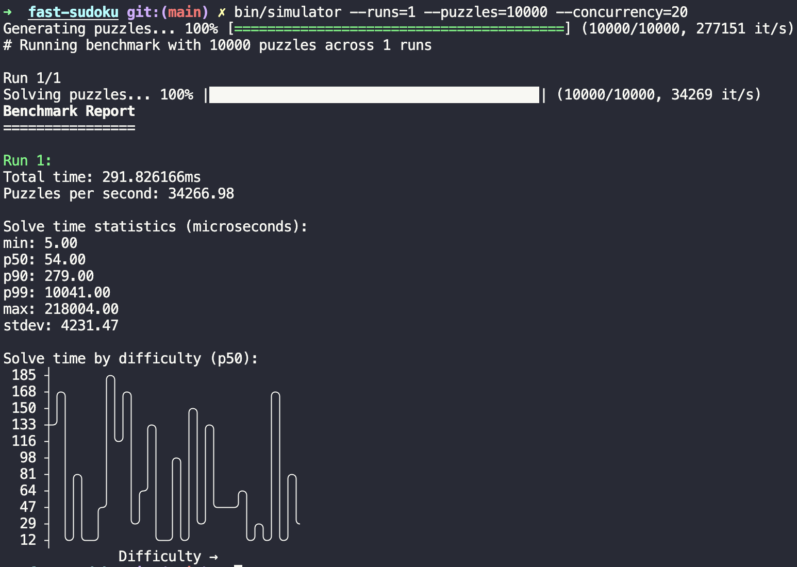

# Fast Sudoku Solver and Simulator

This project contains a fast Sudoku solver and a simulator for benchmarking the solver's performance



## Build Instructions

Ensure you have [Go](https://golang.org/doc/install) installed (version 1.23.3 or later).

To build the solver and simulator, run:

```bash
make build
```

This will compile the binaries and place them in the `bin` directory.

## Running the Simulator

The simulator benchmarks the solver across multiple puzzles and runs.

To run the simulator with default settings, execute:

```bash
./bin/simulator
```

You can customize the simulator using the following flags:

- `-puzzles`: Number of puzzles to generate (default: 10000)
- `-min-difficulty`: Minimum number of empty cells (default: 30)
- `-max-difficulty`: Maximum number of empty cells (default: 60)
- `-concurrency`: Maximum number of concurrent solvers (default: 40)
- `-runs`: Number of benchmark runs (default: 3)

Example:

```bash
./bin/simulator -puzzles 5000 -runs 5
```

## Dependencies

This project uses the following third-party libraries:

- [fatih/color](https://github.com/fatih/color) for colored terminal output.
- [guptarohit/asciigraph](https://github.com/guptarohit/asciigraph) for plotting graphs in the terminal.
- [schollz/progressbar](https://github.com/schollz/progressbar) for displaying progress bars.

These dependencies are managed via Go modules and will be downloaded automatically during the build process.

## Testing

To run the tests:

```bash
make test
```

Or directly using the `go` command:

```bash
go test ./...
```

## License

This project is licensed under the MIT License.
